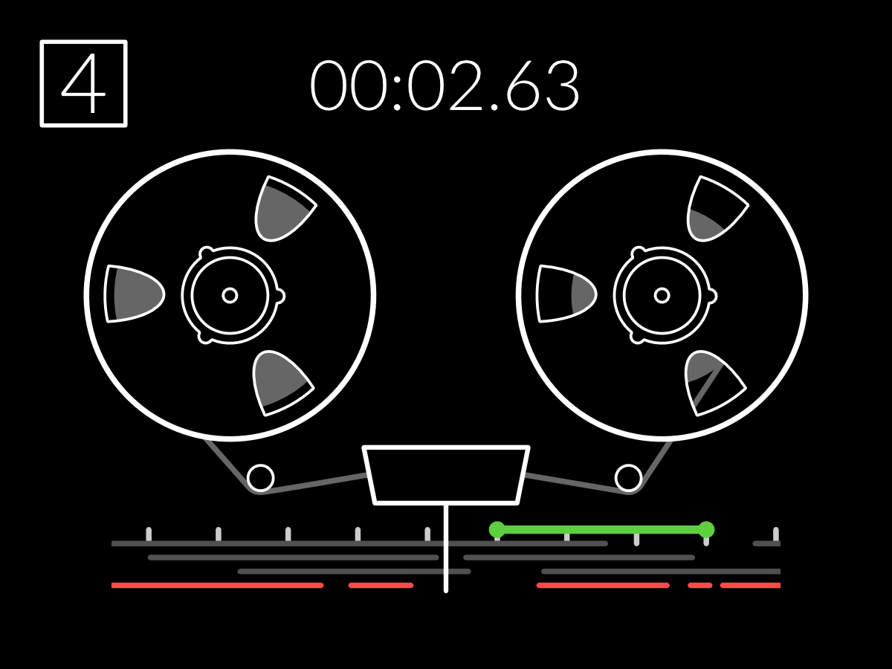

# TOP-1
**T**otally **O**riginal **P**roject **1**
A conceptual (and sometimes direct) clone of the Teenage Enginering OP-1, running on a Raspberry Pi.

UI example: 4 track tape recorder:

More info to follow

If you are interested in the project in any way, open an issue and we'll get in touch!
