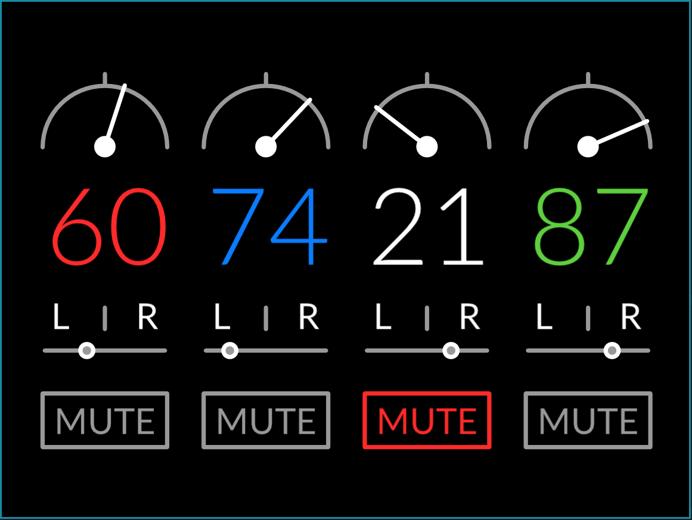
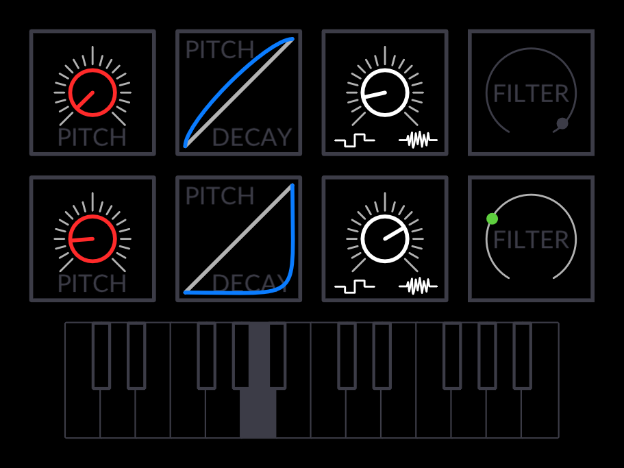

# TOP-1: **T**otally **O**riginal **P**roject-**1**

Ah, who doesnt love the [op-1](teenage.engineering/products/op-1)? Its a magical beast of modern technology! Everything you need to play around with electronic music, in one self-contained device. Its pretty close to perfect, but not quite - its simplicity is its power, but it's also the source of its shortcomings. And then of course, it's not open source.

Come chat with me at my [discord server](https://discord.gg/4cV9Ucz) if you're interested in the project.

### Introducing the TOP-1!  
To be fair, the TOP-1 is an op-1 clone. But i like to think it's a bit more than that. Some differences will be subtle, and some differences will be big. Especially the non-core modules will differ greatly, as most of them are designed fully independently. The UI too varies, from the tapedeck, which is practically the same, to the metronome, which is very different (see both below).

## Screenshots:  
 
 

## Current Progress  
The tapedeck is completed, with a few bugs left to iron out, and with the addition of the metronome, mixer, and input selector, the software is just about ready to be used for recording with external synthesizers. It runs in an OpenGLFW window, and the buttons and rotaries are emulated with keyboard shortcuts.

## Future Plans
 - [ ] Input selection screen - select external audio, internal audio, or the mixer output
 - [ ] Sequencers - A few basic ones are planned
 - [ ] Synthesizers - One or two simple synths
 - [ ] Effects - Filter, EQ, Delay, Bit crushing etc
 - [ ] Sampler - This is the big one!
 - [ ] Modulation - LFO mainly
And from there its just modules, modules, modules

# Getting Involved
If you're up for it, I'd love some help, for a lot of different things, like
 - Software testing
 - Writing documentation
 - Hardware design / testing
 - UI design
 - Creating default samples & settings
and of course, the coding itself, with areas like
 - Synth/Effect design (I know very little about dsp)
 - General backend design
 - Hardware bridging
 - Distro setup - a custom distro for the Pi might be necessary

## Credits
 - Audio Framework: [jack](http://jackaudio.org/)
 - DSP Framework: [faust](http://faust.grame.fr/)
 - Vector Graphics: [NanoVG](https://github.com/memononen/nanovg) with [NanoCanvas](https://github.com/Geequlim/NanoCanvas)
 - [plog](https://github.com/SergiusTheBest/plog), a great little logging lib
 - [fmtlib](http://fmtlib.net), string formatting in C++
 - [json](https://github.com/nlohmann/json/), json for modern C++
 - [mapbox/variant](https://github.com/mapbox/variant), one of the best variant implementations out there

And of course, none of this would be posible without [spacemacs](http://spacemacs.org/), because i would've given up programming long ago

