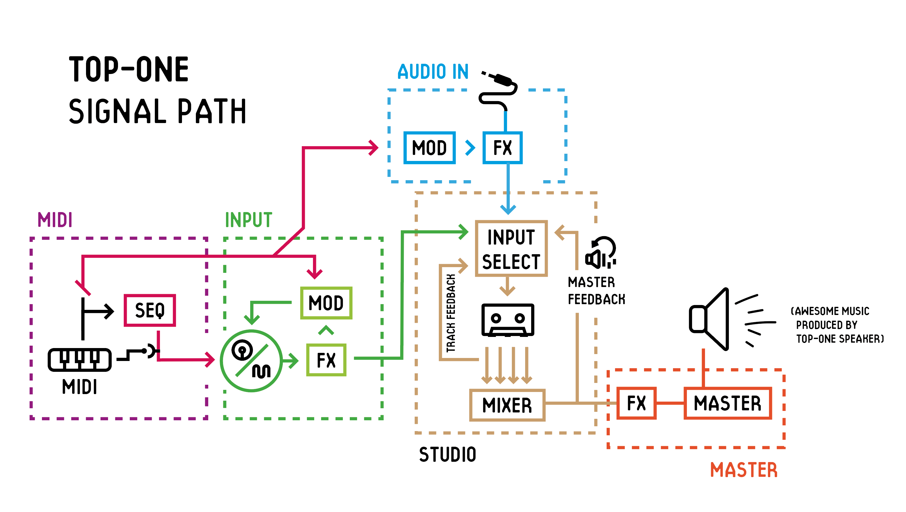

# TOP-1: Totally Original Project-1
[](https://travis-ci.org/topisani/TOP-1)

Making electronic music is awesome! But for most of us, it requires a lot of setup, a lot of moving a mouse around on a laptop that's probably not quite equipped to handle realtime audio processing.

### Introducing the TOP-1!  
The TOP-1 is a full hardware and software solution, with synths, a sampler, effects, sequencers, and studio modules. It is heavily inspired by the OP-1, but takes some things in a different direction. The goal is to create an all-in-one portable device, that allows anyone to play around with electronic music. It shall be open and accessible, while maintaining the very constrained interfaces, necessary to really be creative.

Come chat with us at our [discord server](https://discord.gg/4cV9Ucz) if you're interested in the project.

# Screenshots:  
@D-I-S-K-U-S has been working hard on graphics, and these are some of the highlights:

 
 

# The final product
The software is modular, with modules in six groups: Synths, drums, effects, modulation, sequencing, and studio. These modules are chained together as can be seen in this diagram:



Each module has up to 4 settings, that can be controlled using 4 rotary encoders. Like the OP-1, the colours of the 4 rotaries corresponds to the colour of the option on screen that will be changed. Each module slot will be accessible from a single hardware button press.

The software will be set up to run on a Raspberry Pi, with a small AMOLED screen, 4 rotary encoders, and around 20 buttons. This can then be built into any kind of enclosure, with or without a midi keyboard and other bells and whistles.

# Current progress
A lot of the main software backend is completed. The 4-track tapedeck is implemented, along with the mixer and the metronome. We are working hard on synths and drums, currently theres a proof of concept additive drum synthesizer, and drum and synth samplers.

Currently, it runs in a window on your desktop, and uses [jack](http://jackaudio.org/) for audio. We have been considering using [portaudio](http://portaudio.com/) instead, as it is better for cross platform development. Currently the TOP-1 only runs on linux, but there are efforts to get it running on [OS X](https://github.com/topisani/TOP-1/issues/13) and windows.

## Keybindings
These are the keybindings currently emulating the hardware buttons:

| Key         | Action              | Key                 | Action              |
|-------------|---------------------|---------------------|---------------------|
| Ctrl        | (mod) Encoder Click |                     |                     |
| Q           | +Red Encoder        | A                   | -Red Encoder        |
| W           | +Blue Encoder       | S                   | -Blue Encoder       |
| E           | +White Encoder      | D                   | -White Encoder      |
| R           | +Green Encoder      | F                   | -Green Encoder      |
| Left Arrow  | Rewind              | Shift + Left Arrow  | Skip Rewind         |
| Right Arrow | Forward             | Shift + Right Arrow | Skip Forward        |
| Space       | Play                | Z                   | Record              |
| F1          | Track 1             | F2                  | Track 2             |
| F3          | Track 3             | F4                  | Track 4             |
| Ctrl + T    | Tape                | Ctrl + Y            | Mixer               |
| Ctrl + U    | Synth               | Ctrl + G            | Metronome           |
| I           | Go to Loop In       | Shift + I           | Set Loop In         |
| O           | Go to Loop Out      | Shift + O           | Set Loop Out        |
| L           | Toggle Looping      | Ctrl + X            | Cut Tape Selection  |
| Ctrl + C    | Lift Tape Selection | Ctrl + V            | Drop Tape Selection |

# Installation
The TOP-1 is written in bleeding edge C++17, which gives some problems with dependencies. First of all, you need a up to date compiler, GCC-7 or clang 5.0 should work. The biggest problem is the standard library. Currently i think only `libstdc++ 7` has all that we need. This will probable change in a few months, as other implementations catch up.

For Debian/Ubuntu, this should install most of the dependencies. If you dont have `g++-7`, google how to get it for your specific version.
```bash
apt install jackd\
    g++-7\
    libjack-jackd2-dev\
    libgles2-mesa-dev -y
```

You will also need cmake 3.8 or above, get it [here](https://cmake.org/download/)

I recommend also installing `patchage` and `jack-keyboard`, but they are in no way required.

With this set up, you should be able to build & run the TOP-1 with
```
cmake .
make -j4
bin/top-1
```

As previously mentioned, there are (currently unfruitful) efforts to run on [OS X](https://github.com/topisani/TOP-1/issues/13) and windows.

## Faust
Nearly all DSP in the TOP-1 is written in [faust](http://faust.grame.fr/). Faust compiles to C++, and if you dont have plans to edit the `.dsp` files, you don't have to worry about faust. If you do want to do DSP work, it is very important that you use the correct faust version, which currently is `0.9.104`. To install that, run the following commands:
```bash
git clone https://github.com/grame-cncm/faust
cd faust
git checkout 24db8d98e63aa8a119ffc601bf6aeec3e33e7a86
make
sudo make install
```
Once you have faust installed, verify that the `faust` command uses the correct version. You should see something like this:
```bash
$ faust --version
FAUST, DSP to C++ compiler, Version 0.9.104
Copyright (C) 2002-2017, GRAME - Centre National de Creation Musicale. All rights reserved. 
```

Then, make the apropriate changes in the `.dsp` files, and compile them by running
```
sh scripts/compile-faust.sh
```

# Getting Involved
We are a small group of people who would really appreciate your help or just your interest in the project. If you do want to help, these are some areas you could help with:

 - Software testing
 - Writing documentation
 - Hardware design / testing
 - UI design
 - Creating default samples & settings
 
And of course, the coding itself, with areas like
 - Synth/Effect design
 - General backend design
 - Hardware bridging
 - Distro setup - a custom distro for the Pi might be necessary

If you are interested, come chat with us at our [discord server](https://discord.gg/4cV9Ucz), its where all the magic happens!

# Credits
 - Audio Framework: [jack](http://jackaudio.org/)
 - DSP Framework: [faust](http://faust.grame.fr/)
 - Vector Graphics: [NanoVG](https://github.com/memononen/nanovg) with [NanoCanvas](https://github.com/Geequlim/NanoCanvas)
 - [plog](https://github.com/SergiusTheBest/plog), a great little logging lib
 - [fmtlib](http://fmtlib.net), string formatting in C++
 - [json](https://github.com/nlohmann/json/), json for modern C++
